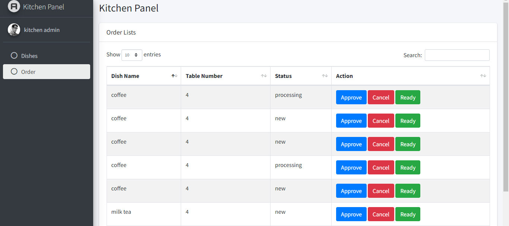
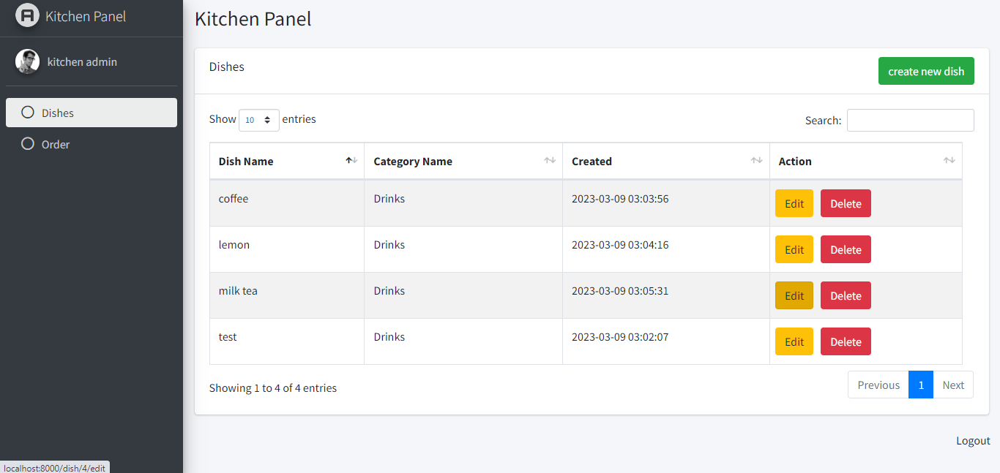

## sample blog web app laravel

***You can run this project by following the steps that I mentioned below.*** 
  &emsp;***Step1***: clone the github repo to your local project folder. 
  &emsp;***Step2***: In your cloned folder, rename *.env.example*  :arrow_right: *.env* and in .env file you need to change your database name 
  &emsp;***Step3***: navigate your cloned folder and run
     &emsp;&emsp;<code>composer install</code>
     &emsp;&emsp;<code>php artisan key:generate</code>
     &emsp;&emsp;<code>php artisan migrate --seed </code> 
    After these steps, you are ready to start your project by running <code>php artisan serve</code>
    
